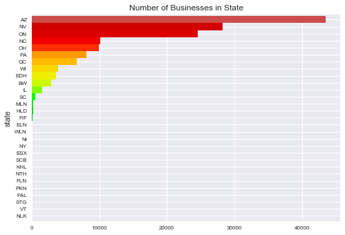
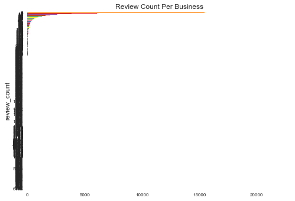
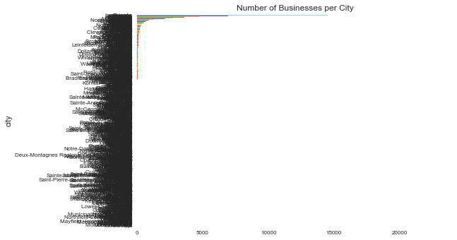

```python
import pandas as pd
```


```python
business = pd.read_json('yelp_dataset_challenge_round9/yelp_academic_dataset_business.json',lines = True)
```


```python
business.shape
```


    (144072, 16)


```python
business.head(n=3)
```


<div>
<table border="1" class="dataframe">
  <thead>
    <tr style="text-align: right;">
      <th></th>
      <th>address</th>
      <th>attributes</th>
      <th>business_id</th>
      <th>categories</th>
      <th>city</th>
      <th>hours</th>
      <th>is_open</th>
      <th>latitude</th>
      <th>longitude</th>
      <th>name</th>
      <th>neighborhood</th>
      <th>postal_code</th>
      <th>review_count</th>
      <th>stars</th>
      <th>state</th>
      <th>type</th>
    </tr>
  </thead>
  <tbody>
    <tr>
      <th>0</th>
      <td>227 E Baseline Rd, Ste J2</td>
      <td>[BikeParking: True, BusinessAcceptsBitcoin: Fa...</td>
      <td>0DI8Dt2PJp07XkVvIElIcQ</td>
      <td>[Tobacco Shops, Nightlife, Vape Shops, Shopping]</td>
      <td>Tempe</td>
      <td>[Monday 11:0-21:0, Tuesday 11:0-21:0, Wednesda...</td>
      <td>0</td>
      <td>33.378214</td>
      <td>-111.936102</td>
      <td>Innovative Vapors</td>
      <td></td>
      <td>85283</td>
      <td>17</td>
      <td>4.5</td>
      <td>AZ</td>
      <td>business</td>
    </tr>
    <tr>
      <th>1</th>
      <td>495 S Grand Central Pkwy</td>
      <td>[BusinessAcceptsBitcoin: False, BusinessAccept...</td>
      <td>LTlCaCGZE14GuaUXUGbamg</td>
      <td>[Caterers, Grocery, Food, Event Planning &amp; Ser...</td>
      <td>Las Vegas</td>
      <td>[Monday 0:0-0:0, Tuesday 0:0-0:0, Wednesday 0:...</td>
      <td>1</td>
      <td>36.192284</td>
      <td>-115.159272</td>
      <td>Cut and Taste</td>
      <td></td>
      <td>89106</td>
      <td>9</td>
      <td>5.0</td>
      <td>NV</td>
      <td>business</td>
    </tr>
    <tr>
      <th>2</th>
      <td>979 Bloor Street W</td>
      <td>[Alcohol: none, Ambience: {'romantic': False, ...</td>
      <td>EDqCEAGXVGCH4FJXgqtjqg</td>
      <td>[Restaurants, Pizza, Chicken Wings, Italian]</td>
      <td>Toronto</td>
      <td>[Monday 11:0-2:0, Tuesday 11:0-2:0, Wednesday ...</td>
      <td>1</td>
      <td>43.661054</td>
      <td>-79.429089</td>
      <td>Pizza Pizza</td>
      <td>Dufferin Grove</td>
      <td>M6H 1L5</td>
      <td>7</td>
      <td>2.5</td>
      <td>ON</td>
      <td>business</td>
    </tr>
  </tbody>
</table>
</div>


```python

```

    Nlk        1
    Vt         1
    Stg        1
    Fal        1
    Pkn        1
    Fln        1
    Nth        1
    Khl        1
    Scb        3
    Esx       11
    Ny        13
    Ni        20
    Wln       34
    Eln       36
    Fif       72
    Hld      172
    Mln      191
    Sc       498
    Il      1556
    Bw      2905
    Edh     3539
    Wi      3899
    Qc      6668
    Pa      8091
    Oh      9966
    Nc     10177
    On     24507
    Nv     28214
    Az     43492
    dtype: int64


```python
import matplotlib.pyplot as plt
import seaborn as sns
import numpy as np
def plot_bar(df, title):
    
    p = (
        'Set2', 'Paired', 'colorblind', 'husl',
        'Set1', 'coolwarm', 'RdYlGn', 'spectral'
        )

    #title = 'Number of Businesses in State'
    #df = col_freq

    color = sns.color_palette(np.random.choice(p), len(df))
    bar = df.plot(kind='barh', 
             title=title, 
             fontsize=8,
             #figsize(12,8),
             stacked=False,
             width=1,
             color=color,)

    plt.show()

import operator
import string
#plot top crimes (preprocess information: group the columns for bar plot)

def plot(df, column, title):
    #df = business
    #column = 'state'

    lower_case = operator.methodcaller('lower')
    df.columns = df.columns.map(lower_case)
    by_col = df.groupby(column)
    col_freq = by_col.size()
    #col_freq.index = col_freq.index.map(string.capwords)

    col_freq.sort_values(inplace=True)
    
    plot_bar(col_freq, title)

plot(business, 'state', 'Number of Businesses in State')
plot(business, 'review_count', 'Review Count Per Business')
```








```python
plot(business, 'city', 'Number of Businesses per City')
```





```python
checkin = pd.read_json('yelp_dataset_challenge_round9/yelp_academic_dataset_checkin.json', lines= True)
```


```python

```


```python
checkin.shape
```


    (125532, 3)


```python
checkin.head(n=3)
```


<div>
<table border="1" class="dataframe">
  <thead>
    <tr style="text-align: right;">
      <th></th>
      <th>business_id</th>
      <th>time</th>
      <th>type</th>
    </tr>
  </thead>
  <tbody>
    <tr>
      <th>0</th>
      <td>7KPBkxAOEtb3QeIL9PEErg</td>
      <td>[Fri-0:2, Sat-0:1, Sun-0:1, Wed-0:2, Sat-1:2, ...</td>
      <td>checkin</td>
    </tr>
    <tr>
      <th>1</th>
      <td>kREVIrSBbtqBhIYkTccQUg</td>
      <td>[Mon-13:1, Thu-13:1, Sat-16:1, Wed-17:1, Sun-1...</td>
      <td>checkin</td>
    </tr>
    <tr>
      <th>2</th>
      <td>tJRDll5yqpZwehenzE2cSg</td>
      <td>[Thu-0:1, Mon-1:1, Mon-12:1, Sat-16:1]</td>
      <td>checkin</td>
    </tr>
  </tbody>
</table>
</div>


```python
tip = pd.read_json('yelp_dataset_challenge_round9/yelp_academic_dataset_tip.json', lines=True)
```


```python
tip.shape
```


    (946600, 6)


```python
tip.head(n=3)
```


<div>
<table border="1" class="dataframe">
  <thead>
    <tr style="text-align: right;">
      <th></th>
      <th>business_id</th>
      <th>date</th>
      <th>likes</th>
      <th>text</th>
      <th>type</th>
      <th>user_id</th>
    </tr>
  </thead>
  <tbody>
    <tr>
      <th>0</th>
      <td>tJRDll5yqpZwehenzE2cSg</td>
      <td>2012-07-15</td>
      <td>0</td>
      <td>Get here early enough to have dinner.</td>
      <td>tip</td>
      <td>zcTZk7OG8ovAmh_fenH21g</td>
    </tr>
    <tr>
      <th>1</th>
      <td>jH19V2I9fIslnNhDzPmdkA</td>
      <td>2015-08-12</td>
      <td>0</td>
      <td>Great breakfast large portions and friendly wa...</td>
      <td>tip</td>
      <td>ZcLKXikTHYOnYt5VYRO5sg</td>
    </tr>
    <tr>
      <th>2</th>
      <td>dAa0hB2yrnHzVmsCkN4YvQ</td>
      <td>2014-06-20</td>
      <td>0</td>
      <td>Nice place. Great staff.  A fixture in the tow...</td>
      <td>tip</td>
      <td>oaYhjqBbh18ZhU0bpyzSuw</td>
    </tr>
  </tbody>
</table>
</div>


```python
user = pd.read_json('yelp_dataset_challenge_round9/yelp_academic_dataset_user.json', lines=True)
```


```python
user.shape
```


    (1029432, 23)


```python
user.head(n=3)
```


<div>
<table border="1" class="dataframe">
  <thead>
    <tr style="text-align: right;">
      <th></th>
      <th>average_stars</th>
      <th>compliment_cool</th>
      <th>compliment_cute</th>
      <th>compliment_funny</th>
      <th>compliment_hot</th>
      <th>compliment_list</th>
      <th>compliment_more</th>
      <th>compliment_note</th>
      <th>compliment_photos</th>
      <th>compliment_plain</th>
      <th>...</th>
      <th>elite</th>
      <th>fans</th>
      <th>friends</th>
      <th>funny</th>
      <th>name</th>
      <th>review_count</th>
      <th>type</th>
      <th>useful</th>
      <th>user_id</th>
      <th>yelping_since</th>
    </tr>
  </thead>
  <tbody>
    <tr>
      <th>0</th>
      <td>3.59</td>
      <td>4192</td>
      <td>79</td>
      <td>4192</td>
      <td>3904</td>
      <td>19</td>
      <td>305</td>
      <td>4705</td>
      <td>1347</td>
      <td>2617</td>
      <td>...</td>
      <td>[2017, 2015, 2016, 2014, 2011, 2013, 2012]</td>
      <td>298</td>
      <td>[iJg9ekPzF9lkMuvjKYX6uA, ctWAuzS04Xu0lke2Rop4l...</td>
      <td>12316</td>
      <td>Rob</td>
      <td>761</td>
      <td>user</td>
      <td>18456</td>
      <td>EZmocAborM6z66rTzeZxzQ</td>
      <td>2009-09-12</td>
    </tr>
    <tr>
      <th>1</th>
      <td>4.29</td>
      <td>144</td>
      <td>11</td>
      <td>144</td>
      <td>64</td>
      <td>1</td>
      <td>4</td>
      <td>97</td>
      <td>24</td>
      <td>129</td>
      <td>...</td>
      <td>[None]</td>
      <td>34</td>
      <td>[r2UUCzGxqI6WPsiWPgqG2A, qewG3X2O4X6JKskxyyqFw...</td>
      <td>28</td>
      <td>Vivian</td>
      <td>80</td>
      <td>user</td>
      <td>117</td>
      <td>myql3o3x22_ygECb8gVo7A</td>
      <td>2009-06-27</td>
    </tr>
    <tr>
      <th>2</th>
      <td>4.15</td>
      <td>36</td>
      <td>1</td>
      <td>36</td>
      <td>14</td>
      <td>2</td>
      <td>10</td>
      <td>21</td>
      <td>4</td>
      <td>23</td>
      <td>...</td>
      <td>[2011, 2016, 2017, 2013, 2014, 2015, 2012]</td>
      <td>48</td>
      <td>[qewG3X2O4X6JKskxyyqFwQ, -50XWnmQGqBgEI-9ANvLl...</td>
      <td>6</td>
      <td>Carol</td>
      <td>841</td>
      <td>user</td>
      <td>58</td>
      <td>FIk4lQQu1eTe2EpzQ4xhBA</td>
      <td>2010-08-26</td>
    </tr>
  </tbody>
</table>
<p>3 rows × 23 columns</p>
</div>


```python

```


```python
#remove trailing "\n" from each line
data = map(lambda x: x.rstrip(), data)

data_json_str = "[" + ','.join(data) + "]"

#now load into pandas
data_review = pd.read_json(data_json_str)
```


    ---------------------------------------------------------------------------

    TypeError                                 Traceback (most recent call last)

    <ipython-input-35-f27346b3da12> in <module>()
          2 data = map(lambda x: x.rstrip(), data)
          3 
    ----> 4 data_json_str = "[" + ','.join(data) + "]"
          5 
          6 #now load into pandas


    TypeError: sequence item 0: expected str instance, bytes found


```python
reviews = data_review
```


```python
reviews.shape
```


    (0, 0)


```python
data_review.shape

```


    (0, 0)


```python
data_review
```


<div>
<table border="1" class="dataframe">
  <thead>
    <tr style="text-align: right;">
      <th></th>
    </tr>
  </thead>
  <tbody>
  </tbody>
</table>
</div>


```python
data.shape
```


    ---------------------------------------------------------------------------

    AttributeError                            Traceback (most recent call last)

    <ipython-input-32-4d6baf1a67bf> in <module>()
    ----> 1 data.shape
    

    AttributeError: 'map' object has no attribute 'shape'


```python
data
```


    <map at 0x1441ddeb8>


```python
import sys
import json
#reads entire file into python array
file = 'yelp_dataset_challenge_round9/yelp_academic_dataset_review.json'

reviews = []
with open(file) as f:
    for line in f:
        reviews.append(json.loads(line))
        

```


```python
print(len(reviews))
```

    4153150


```python
print(len(reviews[0]))
```

    10


```python
print(reviews[0])
```

    {'business_id': '2aFiy99vNLklCx3T_tGS9A', 'stars': 5, 'funny': 0, 'type': 'review', 'user_id': 'KpkOkG6RIf4Ra25Lhhxf1A', 'review_id': 'NxL8SIC5yqOdnlXCg18IBg', 'cool': 0, 'date': '2011-10-10', 'useful': 0, 'text': "If you enjoy service by someone who is as competent as he is personable, I would recommend Corey Kaplan highly. The time he has spent here has been very productive and working with him educational and enjoyable. I hope not to need him again (though this is highly unlikely) but knowing he is there if I do is very nice. By the way, I'm not from El Centro, CA. but Scottsdale, AZ."}


```python
print(reviews[1])
```


    ---------------------------------------------------------------------------

    NameError                                 Traceback (most recent call last)

    <ipython-input-1-59c43d2032bf> in <module>()
    ----> 1 print(reviews[1])
    

    NameError: name 'reviews' is not defined


Reviews data contains review_id, user_id, business_id, stars, date, text, useful, funny, cool, type. 


```python

```
